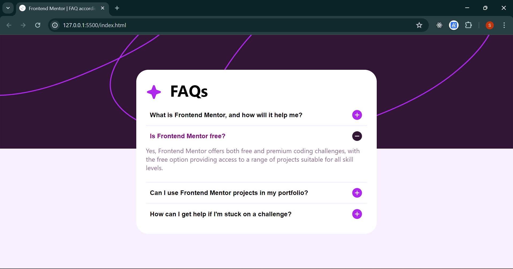

# Frontend Mentor - FAQ accordion solution

This is a solution to the [FAQ accordion challenge on Frontend Mentor](https://www.frontendmentor.io/challenges/faq-accordion-wyfFdeBwBz). Frontend Mentor challenges help you improve your coding skills by building realistic projects. 

## Table of contents

- [Overview](#overview)
  - [The challenge](#the-challenge)
  - [Screenshot](#screenshot)
  - [Links](#links)
- [My process](#my-process)
  - [Built with](#built-with)
  - [What I learned](#what-i-learned)
  - [Continued development](#continued-development)
- [Author](#author)

## Overview

### The challenge

Users should be able to:

- Hide/Show the answer to a question when the question is clicked
- Navigate the questions and hide/show answers using keyboard navigation alone
- View the optimal layout for the interface depending on their device's screen size
- See hover and focus states for all interactive elements on the page

### Screenshot

### Links

- Solution URL: [Add solution URL here](https://your-solution-url.com)
- Live Site URL: [Add live site URL here](https://your-live-site-url.com)

## My process

### Built with

- Semantic HTML5 markup
- CSS custom properties
- Flexbox
- CSS Grid
- Javascript*

### What I learned
Building a FAQ accordion as part of Frontend Mentor challenges can teach you several key concepts and skills:

1. DOM Manipulation: You'll learn how to manipulate the Document Object Model (DOM) using JavaScript to create interactive elements like accordions.
2. Event Handling: You'll gain experience in handling user interactions, such as clicks, to trigger specific actions or behavior.
3. CSS Styling: You'll explore CSS techniques to style the accordion, including transitions for smooth animations and responsive design for various screen sizes.
4. Accessibility: You'll understand the importance of making your accordion accessible to all users, including those who rely on screen readers or keyboard navigation.
5. Problem-Solving: You'll encounter challenges and bugs while implementing the accordion, helping you develop problem-solving skills by debugging and finding solutions.

### Continued development

Building a FAQ accordion is a great starting point, but you can continue developing your skills and knowledge in several ways:

1. Advanced Interactions: Experiment with more complex interactions, such as nested accordions, collapsible sections within each FAQ item, or using different animation effects.
2. Accessibility Improvements: Dive deeper into accessibility best practices, ensuring your accordion is fully accessible and meets WCAG (Web Content Accessibility Guidelines) standards.
3. JavaScript Frameworks/Libraries: Explore using JavaScript frameworks or libraries like React, Vue.js, or jQuery to build dynamic UI components like accordions more efficiently.
4. Responsive Design: Enhance your responsive design skills by optimizing the accordion's layout and behavior for various devices, such as mobile phones and tablets.
5. CSS Preprocessors: Learn and use CSS preprocessors like Sass or Less to write cleaner and more maintainable CSS code for styling your accordions.

## Author

- Github - [Subalakshmi T](https://github.com/subalakshmi-21)
- Frontend Mentor - [@subalakshmi-21](https://www.frontendmentor.io/profile/subalakshmi-21)
- LinkedIn - [Subalakshmi T](https://www.linkedin.com/in/subalakshmi-t-19598425a/)

